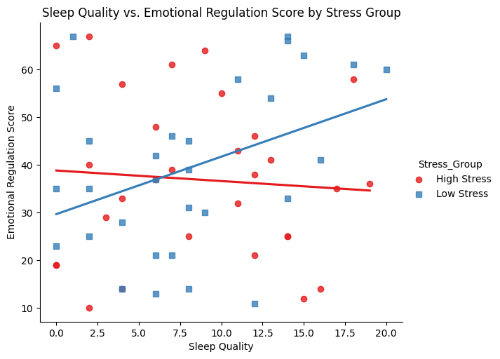

# Sleep Deprivation & Cognitive Performance Analysis

This repository contains an exploratory data analysis (EDA) and moderation analysis investigating how sleep factors relate to cognitive and emotional outcomes. In particular, we examine whether stress levels moderate the relationships between sleep metrics and performance outcomes.

## Overview

### Objective:

The study examines the relationships between sleep metrics—such as sleep hours and sleep quality—and performance outcomes, including reaction time and emotion regulation. An additional focus is on how stress modifies these relationships.

### Key Findings:

1. **Low Stress Group (Emotion Regulation):**

In the subgroup of participants with low stress, there is a significant positive relationship between sleep quality and emotion regulation. After centering, for each 1-unit increase in sleep quality above the mean, emotion regulation scores increase by approximately 1.20 points. This model explains about 14.8% of the variance in emotion regulation, and the result is statistically significant (p ≈ 0.036).

1. **High Stress Group (PVT Reaction Time):**

In the high stress subgroup, a significant negative relationship was found between sleep hours and reaction time. Specifically, for each additional hour of sleep, PVT reaction time decreases by roughly 16.92 units, indicating faster reaction times. This model accounts for approximately 14.7% of the variance in reaction time and is statistically significant (p ≈ 0.037).

## Data Description

The dataset includes measures such as:

- Sleep Hours
- Sleep Quality Score
- Daytime Sleepiness
- Stroop Task Reaction Time
- N-Back Accuracy
- Emotion Regulation Score
- PVT Reaction Time
- Age, Gender, BMI, Caffeine Intake, Physical Activity Level, and Stress Level

Participants were also grouped into subcategories based on stress levels, sleep quality, and BMI to facilitate subgroup analyses.

## EDA and Analysis Summary

The analysis process involved:

- Generating descriptive statistics and visualizations to understand variable distributions and relationships.
- Creating subgroups based on stress levels (Low Stress and High Stress) to explore moderation effects.
- Conducting moderation analyses to determine how sleep quality and sleep hours predict emotion regulation and reaction time within these subgroups.

## Detailed Results

Low Stress Group Analysis (Emotion Regulation)

- The regression model for the low stress subgroup indicates that, after centering, sleep quality is a significant predictor of emotion regulation.
- The intercept was approximately 39.71, and the coefficient for the centered sleep quality score was about 1.20.
- The model’s R-squared value is 0.148, meaning that 14.8% of the variance in emotion regulation scores is explained by sleep quality in this subgroup.
- The positive relationship (p ≈ 0.036) suggests that higher-than-average sleep quality is associated with better emotion regulation among participants with low stress.

High Stress Group Analysis (PVT Reaction Time)

- In the high stress subgroup, the regression analysis revealed that sleep hours significantly predict PVT reaction time.
- The model produced an intercept of approximately 423.32 and a negative coefficient for sleep hours of around -16.92.
- This finding implies that, for each additional hour of sleep, PVT reaction time decreases by about 16.92 units, indicating improved cognitive performance.
- With an R-squared value of 0.147, about 14.7% of the variance in reaction time is explained by sleep hours in the high stress group, and the result is statistically significant (p ≈ 0.037).

## Conclusion and Next Steps

The findings indicate that stress plays a moderating role in the relationship between sleep metrics and performance outcomes:

- In low stress conditions, better sleep quality is significantly associated with enhanced emotion regulation.
- In high stress conditions, increasing sleep hours is significantly associated with faster reaction times.

While these subgroup models explain a modest amount of the variance, they provide important insights that could guide tailored sleep interventions based on an individual’s stress level. Future research should consider collecting a larger sample to enhance model stability, examining potential outliers, and incorporating additional covariates (such as Age, BMI, and Caffeine Intake) to further refine the models.

This analysis underscores the potential benefits of targeted sleep interventions, suggesting that optimizing sleep may lead to better cognitive and emotional outcomes, particularly when stress levels are taken into account.

Feel free to explore the accompanying notebook for further details and visualizations.

## Acknowledgments

This project was completed as part of a guided learning experience with **Maven Analytics**. Special thanks to Maven Analytics for providing structured guidance and high-quality datasets to enhance analytical skills.
